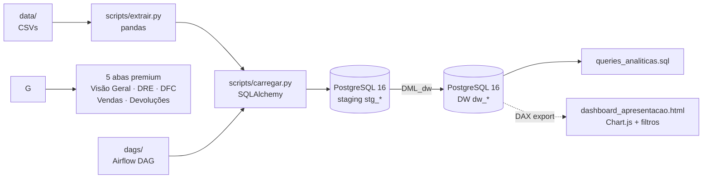

# Pipeline E-commerce — Data Warehouse, Analytics & Dashboards

Pipeline completo de dados para um e-commerce fictício: ingestão CSV → staging PostgreSQL → modelo dimensional (DW) → análises (DRE/DFC) → dashboards interativos (HTML).


---

## Sumário

1. [Visão geral do projeto](#visão-geral-do-projeto)
2. [Arquitetura da solução](#arquitetura-da-solução)
3. [Stack tecnológica](#stack-tecnológica)
4. [Estrutura de pastas](#estrutura-de-pastas)
5. [Modelo de dados](#modelo-de-dados)
6. [Como rodar — Setup local](#como-rodar--setup-local)
7. [Como rodar — Docker (Postgres + Airflow)](#como-rodar--docker-postgres--airflow)
8. [Pipeline ETL](#pipeline-etl)
9. [Dashboard HTML interativo](#dashboard-html-interativo)
10. [Resultados — KPIs do ano](#resultados--kpis-do-ano)
11. [Roadmap & próximos passos](#roadmap--próximos-passos)

---

## Visão geral do projeto

Este repositório implementa um pipeline analítico end-to-end para um e-commerce, da camada de ingestão até a visualização executiva. O caso de uso simula a operação de 2025 com **3.000 pedidos**, **9 estados brasileiros**, **3 canais de venda** (Site, App, Marketplace), **3 formas de pagamento** (Pix, Cartão, Boleto) e **7 categorias de produto** (Notebook, Smartphone, Monitores, Tablet, Áudio, Periféricos, Acessórios).

A entrega cobre dois frentes complementares:

- **Engenharia de dados** — orquestração Airflow, ELT Python, PostgreSQL com staging + DW dimensional.
- **Comunicação de resultados** — dashboard interativo HTML com 5 abas e filtros, e apresentação PowerPoint executiva de 12 slides com paleta premium.

O escopo analítico inclui **DRE (Demonstrativo de Resultado)**, **DFC (Fluxo de Caixa)**, análise de vendas multidimensional, taxa de devolução e cobertura de estoque.

📈 **Link Dashboard:**

---

## Arquitetura da solução



O fluxo é **idempotente**: o ELT aplica DDL e dá `TRUNCATE` antes de cada `INSERT`, então pode ser reexecutado quantas vezes for necessário.

---

## Stack tecnológica

| Camada | Tecnologia | Versão | Propósito |
|---|---|---|---|
| Linguagem | Python | 3.13 | ETL, geração de apresentação |
| Package manager | uv | latest | Resolução determinística de deps |
| ETL / DataFrame | pandas | ≥ 3.0 | Leitura de CSVs e transformações |
| ORM / SQL | SQLAlchemy | ≥ 2.0 | Conexão e execução de DDL/DML |
| Driver | psycopg2-binary | ≥ 2.9 | Driver PostgreSQL |
| Config | python-dotenv | ≥ 1.2 | Variáveis de ambiente |
| Banco | PostgreSQL | 16 | Staging + Data Warehouse |
| Orquestração | Apache Airflow | 2.10.2 | DAG ETL agendável |
| Containerização | Docker Compose | — | Postgres + Airflow webserver/scheduler |
| Frontend | Chart.js | 4.4.1 | Gráficos do dashboard HTML |

---

## Estrutura de pastas

```
projeto_pipeline_ecommerce/
├── config/                      # ⚠️ gitignored — credenciais
│   ├── .env                     # PostgreSQL connection params
│   └── postgres-init.sql        # Cria usuário/banco airflow
├── data/                        # CSVs de entrada
│   ├── vendas.csv
│   ├── devolucoes.csv
│   └── estoque.csv
├── sql/                         # Scripts SQL versionados
│   ├── DDL_staging_ecommerce.sql    # 9 tabelas stg_*
│   ├── DDL_dw_ecommerce.sql         # 3 tabelas dw_*
│   ├── DML_staging_ecommerce.sql    # Inserts staging
│   ├── DML_dw_ecommerce.sql         # Transformações staging → DW
│   ├── 01_vendas.sql
│   ├── 02_devolucoes.sql
│   ├── 03_estoque.sql
│   └── queries_analiticas.sql       # KPIs analíticos de referência
├── scripts/                     # ETL Python
│   ├── extrair.py               # Lê os 3 CSVs em DataFrames
│   └── carregar.py              # aplicar_ddl() + carregar() para Postgres
├── dags/
│   └── pipeline_ecommerce.py    # DAG Airflow: aplicar_ddl >> carregar
├── docs/
│   └── desafio_2_guia_completo.pdf
├── dashboard_apresentacao.html  # Dashboard HTML interativo
├── Dockerfile                   # Imagem Airflow customizada
├── docker-compose.yml           # Postgres + Airflow webserver/scheduler/init
├── pyproject.toml               # Dependências uv
├── uv.lock                      # Lockfile reproduzível
├── .python-version              # 3.13
└── README.md
```

---

## Modelo de dados

A arquitetura segue o padrão **bronze → silver → gold** mapeado em PostgreSQL como **staging → DW dimensional**.

### Camada staging (`stg_*`)

Tabelas que espelham a estrutura dos CSVs de entrada, com dimensões normalizadas:

- **Fatos:** `stg_fact_vendas`, `stg_fact_devolucoes`, `stg_fact_estoque`
- **Dimensões:** `stg_dim_produtos`, `stg_dim_cliente`, `stg_dim_cidade`, `stg_dim_tempo`, `stg_dim_localidade`, `stg_dim_canal_vendas`, `stg_dim_pagamento`

Chaves substitutas com `GENERATED BY DEFAULT AS IDENTITY` (cidade a partir de 500, localidade 200, canal 300, pagamento 300).

### Camada DW (`dw_*`)

Tabelas analíticas desnormalizadas, prontas para BI:

**`dw_vendas`** — 25 colunas, grão pedido + produto:

| Coluna | Tipo | Descrição |
|---|---|---|
| pedido_id | int | Identificador do pedido |
| data_pedido | date | Data da transação |
| dia / mes / ano | int | Particionamento temporal |
| cliente_id | int | FK cliente |
| produto / categoria / marca / fornecedor | text | Hierarquia de produto |
| preco_unitario | numeric(10,2) | Preço de tabela |
| quantidade | int | Itens vendidos |
| desconto / frete / valor_total | numeric(12,2) | Composição financeira |
| canal_venda | text | Site / App / Marketplace |
| forma_pagamento | text | Pix / Cartão / Boleto |
| cidade / estado | text | Geografia |
| status_pedido | text | Entregue / Faturado / Cancelado |

**`dw_devolucoes`** — 17 colunas, grão devolução:

`devolucao_id`, `pedido_id`, `data_devolucao`, `cliente_id`, `produto_id`, `produto`, `categoria`, `marca`, `fornecedor`, `quantidade_devolvida`, `valor_devolvido`, `motivo_devolucao`, `status_devolucao` (Concluída / Em análise).

**`dw_estoque`** — 14 colunas, grão produto + centro de distribuição:

`produto_id`, `produto`, `categoria`, `marca`, `fornecedor`, `preco_unitario`, `estoque_inicial`, `entradas_periodo`, `estoque_atual`, `estoque_minimo`, `estoque_disponivel`, `abaixo_minimo` (boolean), `local_cd_id`, `centro_distribuicao`.

---

## Como rodar — Setup local

### Pré-requisitos

- Python 3.13 (gerenciado via `.python-version`)
- [uv](https://docs.astral.sh/uv/) instalado
- PostgreSQL 16 acessível (local, Docker ou remoto)

### Passos

```bash
# Clone e entre no projeto
git clone <repo>
cd projeto_pipeline_ecommerce

# Sincroniza dependências do pyproject.toml + uv.lock
uv sync

# Configure o .env (não está versionado)
cat > config/.env <<EOF
USER_POSTGRES=postgres
PASSWORD_POSTGRES=postgres
HOST_POSTGRES=localhost
PORT_POSTGRES=5433
DATABASE_POSTGRES=postgres
EOF

# Roda o ELT: aplica DDL e carrega os 3 CSVs
uv run python scripts/carregar.py
```

Saída esperada:

```
vendas:     3000 linhas carregadas
devolucoes: 210 linhas carregadas
estoque:    12 linhas carregadas
```

Em seguida, rode o `DML_staging_ecommerce.sql` + `DML_dw_ecommerce.sql` (manualmente via DBeaver / psql) para popular as tabelas `dw_*` a partir das `stg_*`.

---

## Como rodar — Docker (Postgres + Airflow)

O `docker-compose.yml` sobe três serviços: `postgres` (porta 5433), `airflow-webserver` (8080) e `airflow-scheduler`. O serviço `airflow-init` roda a migração inicial e cria o usuário `admin/admin`.

```bash
# Subir tudo
docker compose up -d

# Acompanhar logs
docker compose logs -f airflow-webserver

# Acessar Airflow UI
open http://localhost:8080
# user: admin / pass: admin
```

Na UI, despause a DAG `pipeline_ecommerce` e dispare uma execução manual. O fluxo é:

```
aplicar_ddl  →  carregar
```

O `aplicar_ddl` itera sobre `sorted(sql/*.sql)` e executa cada arquivo dentro de uma transação; o `carregar` extrai os CSVs em DataFrames e dá `TRUNCATE + INSERT` em cada tabela.

### Variáveis de ambiente injetadas no contêiner

```yaml
USER_POSTGRES: postgres
PASSWORD_POSTGRES: postgres
HOST_POSTGRES: postgres        # nome do serviço dentro da rede docker
PORT_POSTGRES: "5432"
DATABASE_POSTGRES: postgres
```

---

## Pipeline ELT

### `scripts/extrair.py`

```python
def extrair() -> dict[str, pd.DataFrame]:
    return {tabela: pd.read_csv(DATA_DIR / arquivo)
            for tabela, arquivo in ARQUIVOS.items()}
```

Lê os três CSVs em paralelo e retorna um dicionário `{"vendas": df, "devolucoes": df, "estoque": df}`. Função pura e testável.

### `scripts/carregar.py`

Três responsabilidades:

1. **`get_engine()`** — monta a connection string a partir do `.env` e cria um `Engine` SQLAlchemy.
2. **`aplicar_ddl(engine)`** — executa todos os arquivos `sql/*.sql` em ordem alfabética dentro de uma única transação.
3. **`carregar(engine)`** — para cada DataFrame extraído, faz `TRUNCATE` + `to_sql(append)` na tabela de staging correspondente.

### `dags/pipeline_ecommerce.py`

DAG Airflow simples com dois `PythonOperator` em sequência:

```python
ddl = PythonOperator(task_id="aplicar_ddl", python_callable=_aplicar_ddl)
load = PythonOperator(task_id="carregar",   python_callable=_carregar)
ddl >> load
```

Sem `schedule_interval` — execução é manual ou via API/CLI do Airflow.

---

## Dashboard HTML interativo

`dashboard_apresentacao.html` — arquivo único standalone que abre direto no navegador.

**Features:**

- **5 abas** com transição animada: Visão Geral, DRE, DFC, Vendas, Devoluções & Estoque
- **5 filtros globais** com share multiplicativo (Período · Canal · Categoria · Estado · Pagamento)
- **Botão Limpar Filtros** + botão Exportar CSV
- **Chart.js 4.4** via CDN: line, bar, doughnut, pie, combo charts com paleta premium
- **Tabelas com barras de dados** in-place (CSS `--w` custom property)
- **Pills semânticas** Ok/Atenção/Crítico para alertas de estoque
- **Responsivo** para tablet/mobile (breakpoint 1100px)

---

### Financeiro

| KPI | Valor |
|---|---|
| Receita Bruta | **R$ 5.775.324** |
| (−) Devoluções | R$ 278.942 |
| (−) Descontos | R$ 210.350 |
| **(=) Receita Líquida** | **R$ 5.286.032** |
| (−) CMV (60%) | R$ 3.171.619 |
| **(=) Lucro Bruto** | **R$ 2.114.413** |
| (−) Frete | R$ 74.103 |
| **(=) Resultado Operacional** | **R$ 2.040.310** |
| Margem Bruta | **39,99%** |
| Margem Líquida | **35,33%** |

### Operacional

| KPI | Valor |
|---|---|
| Qtd Pedidos | 3.000 |
| Ticket Médio | R$ 1.925,11 |
| Itens Vendidos | ~5.685 |
| Clientes Únicos | múltiplos por estado |
| Taxa de Devolução | 7,00% |
| % Receita Devolvida | 4,83% |
| Fluxo Líquido (DFC) | R$ 5.422.279 |

### Insights principais

- **Notebook lidera o mix** com 48% da receita (R$ 2,77M) — concentração relevante.
- **Pix superou Crédito e Boleto** em receita total (R$ 2,00M, ticket médio R$ 1.982).
- **SP responde por 20%** do faturamento (R$ 1,14M) com 617 pedidos.
- **Outubro foi o mês mais eficiente**, com devoluções de apenas R$ 7,6k (vs média ~R$ 23k).
- **Margem bruta de 40%** está alinhada com benchmark de e-commerce de eletrônicos.
- **Estoque saudável**: todos os 12 produtos têm cobertura acima do mínimo.

---

## Roadmap & próximos passos

- [ ] Validar premissa de CMV de 60% com a área financeira
- [ ] Investigar drivers do pico de eficiência em outubro (logística? mix?)
- [ ] Diversificar mix para reduzir dependência da categoria Notebook
- [ ] Migrar dimensões `stg_*` populadas via DML para serem geradas no Airflow
- [ ] Adicionar testes de qualidade de dados com `pytest` + Great Expectations
- [ ] Publicar dashboard no Power BI Service via fabric-cicd
- [ ] Modelar incremental refresh quando o dataset crescer
- [ ] Adicionar dimensão de cliente real (atualmente só `cliente_id`)

---

## Licença

Projeto de uso educacional. Dados sintéticos.

---

> _Construído em Python 3.13 com uv, PostgreSQL 16, Apache Airflow 2.10 e Power BI Desktop. Maio/2026._
